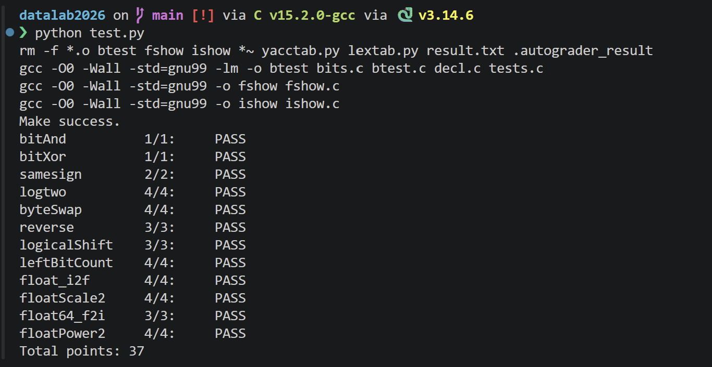

# datalab 报告

姓名：曾铭

学号：2025201706

| 总分 | bitAnd | bitXor | samesign | logtwo | byteSwap | reverse | logicalShift | leftBitCount | float_i2f | floatScale2 | float64_f2i | floatPower2 |
| --- | --- | --- | --- | --- | --- | --- | --- | --- | --- | --- | --- | --- |
| 37 | 1 | 1 | 2 | 4 | 4 | 3 | 3 | 4 | 4 | 4 | 3 | 4 |

test 截图：


<!-- TODO: 用一个通过的截图，本地图片，放到 imgs 文件夹下，不要用这个 github，pandoc 解析可能有问题 -->

## 解题报告

<!-- 告诉助教哪些函数是你实现得最优秀的，比如你可以排序。不需要展开，展开请放到后文中。 -->

### 亮点

1. `logtwo`
2. `float64_f2i`

### logtwo

#### 思路

对于正整数 \(v\)，`logtwo(v)` 等于其二进制表示中最高位 `1` 的位置。
采用 `16 → 8 → 4 → 2 → 1` 的二分定位方式寻找最高有效位，并用按位或组合结果。

伪代码：

```text
ans = 0

依次检查 16、8、4、2、1：
    判断当前高半部分是否非零
    若非零：
        将对应的 16 / 8 / 4 / 2 / 1 记录到 ans
        将 v 右移相应位数

返回 ans
```

实现中，每次比较结果只有 `0` 或 `1`。例如第一步：

```c
int step1 = (v >> 16) > 0;
int move1 = step1 << 4;
```

之后继续在已经缩小的范围内判断，使用 `|` 组合结果

```c id="tbvfoc"
int step2 = ((v >> move1) >> 8) > 0;
int move2 = (step2 << 3) | move1;
```
固定进行 5 轮判断即可确定最高有效位。

### float64_f2i

#### 思路
不完整保存 53 位有效数，只提取最终转换为 32 位整数时真正需要的高位。
其实经过前面的判断，只需要拼接这么多位数（向0舍入直接截断）。

伪代码：

```text
读取 sign 和 exp
E = exp - Bias

if E < 0:
    return 0

if 超出 int 范围:
    return 0x80000000

构造有效数的高 32 位：
    加入规格化数默认的最高位 1
    接上 frac 中需要的部分

根据 E 右移得到整数部分

if sign 表示负数:
    对结果取补码

return result
```

frac拼接为：

```c 
unsigned frac = (1 << 31)
              | ((uf2 & 0x000FFFFF) << 11)
              | ((uf1 & 0x7FF00000) >> 21);
```
可以直接根据实际指数 \(E\) 选择需要的位数：

```c id="wnuqv5"
res = frac >> (31 - E);
```

右移被舍弃的部分正好对应小数部分，因此自然实现向零取整。

### 借鉴思路

1. `float_i2f`
2. `leftBitCount`

### float_i2f

`float_i2f` 需要将整数按照 IEEE 754 单精度浮点数格式进行编码，主要包括符号位、阶码和尾数的处理，并在尾数超出 23 位时进行舍入。

整体过程为：

```text
判断符号位
→ 找到整数最高有效位，确定阶码
→ 将有效数字对齐到固定位置
→ 提取 23 位 frac
→ 对被舍弃部分进行向偶数舍入
→ 拼接 sign、exp、frac
```
其中需要判断frac是否舍入，要看frac后的“第24位”数字，这需要特别判断最高位是否大于23和提取第24位
但是参考思路是：先将整数最高有效位左移到 bit31，使后续各部分的位置固定。

```c
x = x << (31 - x_exp);
```

移动后可以统一看成：

```text
bit31 | bit30 ........ bit8 | bit7 ........ bit0
 隐含1 |    23位 frac       |    舍入部分
```

因此尾数和舍入部分可以直接固定提取，舍入部分再和0x80比较即可

```c
frac = (x >> 8) & 0x7fffff;
round = x & 0xff;
```

这样就不需要根据最高有效位的位置反复计算舍入位的位置，将原本动态的位置问题转化为了固定的 23 位尾数和低 8 位舍入问题。

---

### leftBitCount

#### 思路

`leftBitCount` 需要统计整数从最高位开始连续出现的 `1` 的个数。

这里同样采用类似二分的思想，依次检查：

```text
16 → 8 → 4 → 2 → 1
```

若当前最高的若干位全部为 `1`，就将对应位数累加到 `ans`，同时将 `x` 左移，使尚未检查的部分重新移动到最高位。

伪代码：

```text
ans = 0

依次检查最高 16、8、4、2、1 位：

    若这一段全部为 1：
        ans += 对应位数
        x 左移对应位数

最后处理剩余的最高位
返回 ans
```

参考思路中提到最终答案本身一定可以表示成若干个 2 的幂之和。

因此可以用 `16、8、4、2、1` 逐层确定答案，而不需要逐位扫描 32 个 bit。

同时，每次确定一段连续的 `1` 后，就将这一段左移移出，继续对剩余部分做相同判断，相当于不断缩小问题范围。这个思路和 `logtwo` 中通过 `16 → 8 → 4 → 2 → 1` 定位最高有效位比较类似，也体现了二分和位移结合处理固定宽度整数的思想。

## 参考的重要资料

<!-- 有哪些文章/论文/PPT/课本对你的实现有重要启发或者帮助，或者是你直接引用了某个方法 -->

<!-- 请附上文章标题和可访问的网页路径 -->

PPT中求数字中1的个数的并行思想
[DataLab解析博客](https://arthals.ink/blog/data-lab)主要有参考leftBitCount的思路，以及优化float_i2f的过程